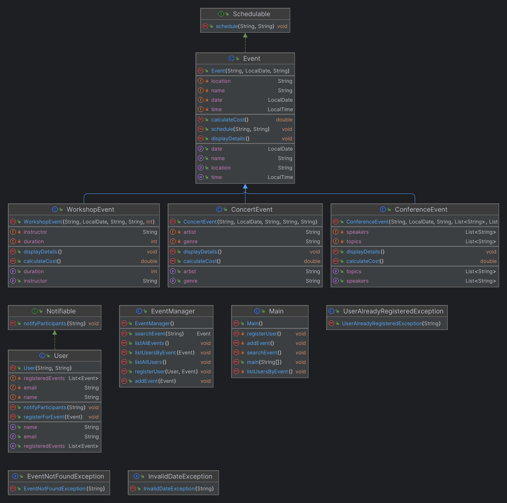

# Eventmanager

A school project designed to learn and apply fundamental and advanced Java concepts.

## 📚 Project Overview

The **Eventmanager** is a console-based application for managing events and user registrations. Developed in an educational context, it demonstrates key Java concepts through practical implementation while meeting specific project requirements.

---

## 🎯 Learning Objectives & Requirements

### **Learning Objectives**
- Master **object-oriented programming (OOP)** principles:
    - **Inheritance**: Sharing attributes and methods across event types (e.g., concerts, workshops).
    - **Polymorphism**: Using abstract methods like `calculateCost()` to handle diverse event-specific logic.
    - **Interfaces**: Implementing the `Notifiable` interface for notifications.
    - **Encapsulation**: Managing data with private attributes and getters/setters.
- Handle errors effectively with **custom exceptions**:
    - `EventNotFoundException` for missing events.
    - `UserAlreadyRegisteredException` for duplicate registrations.
- Build proficiency in using **data structures** like lists for managing users and events.

### **Project Requirements**
1. **Event Management**:
    - Add new events (Concert, Workshop, Conference).
    - List and search events.
2. **User Management**:
    - Register users to events.
    - Display users for a specific event.
3. **Error Handling**:
    - Validate event existence and prevent duplicate registrations.
4. **Modular Structure**:
    - Use inheritance, interfaces, and custom exceptions for clean code organization.
5. **Testing & Documentation**:
    - Ensure functionality through JUnit tests.
    - Use JavaDocs for detailed code documentation.

---
## 📈UML Diagram


---

## 🛠️ Features

- **Event Management**:
    - Add, list, and search events by name.
- **User Management**:
    - Register users and assign them to events.
    - View all users or users registered for specific events.
- **Dynamic Cost Calculation**:
    - Polymorphic handling of costs for different event types.

---

## 🚀 Running the Project

### Prerequisites

- **Java 20** or higher
- **Maven** (for dependency management)
- An IDE like IntelliJ IDEA or Eclipse

### Setting Up the Project

1. **Clone the repository**:
   ```bash
   git clone https://github.com/Koetbullar-Droide/JavaEventManager.git
   cd Eventmanager
   ```

2. **Install dependencies**:
   ```bash
   mvn clean install
   ```

3. **Run the application**:
   ```bash
   mvn exec:java -Dexec.mainClass="org.example.Main"
   ```

---

## 🧪 Running Tests

- Run all tests with:
  ```bash
  mvn test
  ```
- Add new tests in the `src/test/java/org/example` directory.

---

## 🌟 How to Extend

### Suggested Features
1. **New Event Types**:
    - Extend the abstract `Event` class with custom logic for cost calculation and details.
2. **Graphical Interface**:
    - Build a GUI using JavaFX or Swing for a user-friendly interface.
3. **Persistence**:
    - Store event and user data in a database (e.g., SQLite).

---

## 👨‍💻 Authors

- **Jannik Lüthi** - Student, Aspiring Java Developer

---

## 📜 License

This project is developed as part of a school assignment and is intended for educational purposes only.

--- 

